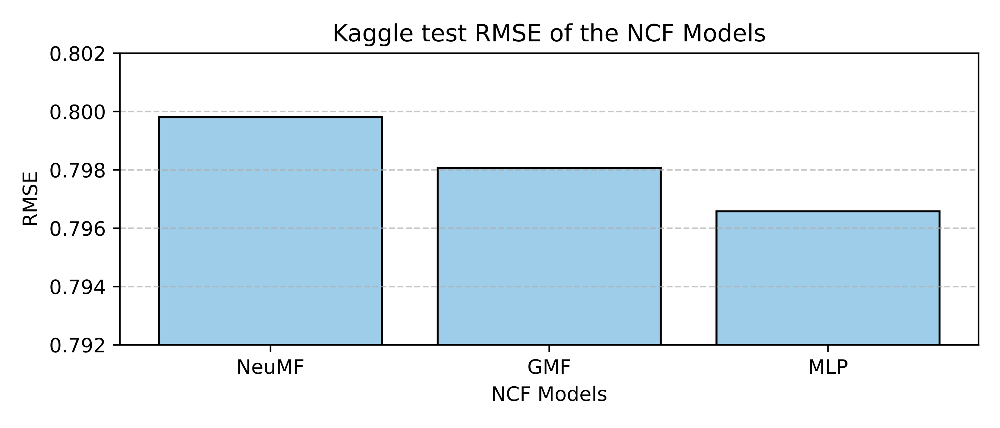
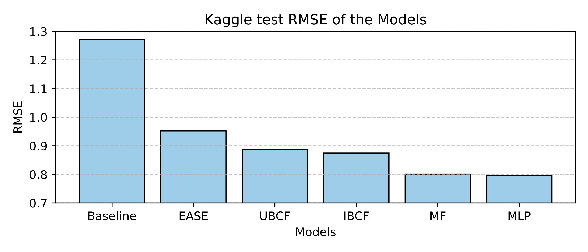

# Recommender Systems

Recommender Systems are software tools and techniques providing suggestions for **items** to be consumed by a **user**.
The suggestions provided are aimed at supporting their users in various decision-making processes, such as what items to
buy, what movie to watch, or what news to read. Recommender systems have proven to be valuable means for online users to
cope with the information overload and have become one of the most powerful and popular tools in electronic commerce.
Correspondingly, various techniques for recommendation generation have been proposed and during the last decade(s), many
of them have also been successfully deployed in commercial environments.

**Authors:** [Renqing Cuomao](mailto:renqing.cuomao@epfl.ch), [Rami Atassi](mailto:rami.atassi@epfl.ch), 
[Paulo Ribeiro](mailto:paulo.ribeirodecarvalho@epfl.ch)

## Project Description

In this project, we are expected to develop a recommender system that is able to predict the rating of a user for a
given book. The metadata of the books can be used as we wish, and we are allowed to use external book metadata sources.
Check out the [project description](https://docs.google.com/document/d/1gHoGLcWpGv2QOMUo2tudYxAGyn4quy4upHLJhiozH4Q) for
more details.

### Requirements

The ratings we can use are the ones in the training set only. We can use standard data manipulation and analysis 
libraries and machine learning/deep learning frameworks with the following exception: **we are not allowed to use 
existing implementations of recommender systems (addressing rating prediction or next-item prediction tasks), even if 
found in the previously mentioned resources, except for the purpose of comparing our own models.**

If we implement a User-based or Item-based Collaborative Filtering system as exposed in the course, the system should 
reach a score better than the score reached by the simple baseline mentioned in the Evaluation section of the project 
description.

### Resources Allowed

- Functions from Numpy, Scipy, Scikit-learn, Pandas, Keras, Gensim, NLTK, or PyTorch that are not implementations of 
recommender systems (addressing rating prediction or next-item prediction tasks).
- General-purpose text pre-processing and pretrained embedding libraries for the metadata, as long as they are not 
fine-tuned for recommender system tasks (such as rating prediction or next-item prediction).
- The functions from LIGHTFM or surprise libraries you may use are limited to data preprocessing and cross-validation.
- Kaggle GPU

## Our Solution

We decided to implement a few methods to build an effective recommender system comparison:

1. **Basic Collaborative Filtering**:
   - As a foundational step, we implemented both User-Based Collaborative Filtering (UBCF) and Item-Based Collaborative 
   Filtering (IBCF). These approaches allowed us to establish a baseline performance while understanding the strengths 
   and weaknesses of traditional methods in modeling user-item interactions.

**Comment:** We observed that IBCF outperformed UBCF, as item-based patterns generalized better in our dataset.

2. **Embarrassingly Shallow AutoEncoders (EASE)**:
   - EASE, a highly effective solution introduced in recent years, excels in ranking user-item interactions with 
   impressive accuracy. We thought it would be interesting to adapt this method to predict user-item ratings, 
   exploring its potential in this context.

**Comment:** EASE predictably performed the worst. This result aligns with its design purpose, which is not for explicit feedback and rating prediction but rather for ranking probable implicit interactions. EASE excels in scenarios where the task involves predicting whether a user will interact with an item, rather than rating the interaction.

3. **Matrix Factorization (MF)**:
   - To improve scalability and accuracy, we adopted a Matrix Factorization approach using Singular Value Decomposition (SVD). This method transformed the sparse user-item interaction matrix into a latent factor space, enabling more effective prediction of user ratings.

**Comment:** While MF demonstrated competitive performance, it struggled to capture non-linear patterns in user-item interactions.

4. **Neural Collaborative Filtering (NCF)**:
   - Building upon the limitations of MF, we implemented Neural Collaborative Filtering (NCF) models. These included:
     - Generalized Matrix Factorization (GMF): Extended the MF model using neural network layers for greater flexibility.
     - Multi-Layer Perceptron (MLP): Modeled complex non-linear relationships between users and items.
     - NeuMF: A hybrid model combining GMF and MLP, aiming to leverage the benefits of both.

**Comment:** Through hyperparameter optimization using the `Optuna` library, we identified that MLP achieved the best performance in terms of Root Mean Squared Error (RMSE), while also being computationally efficient.

### Conclusion
After rigorous experimentation, we selected MLP as our final model for its superior RMSE and efficiency. Our solution 
effectively balances predictive performance and computational efficiency. By combining collaborative filtering 
with neural network techniques (NCF), we demonstrated the ability to predict user ratings with decent accuracy while 
maintaining scalability. This comprehensive approach ensures the system is robust, interpretable, and adaptable to 
various datasets and recommendation scenarios.

  
  

